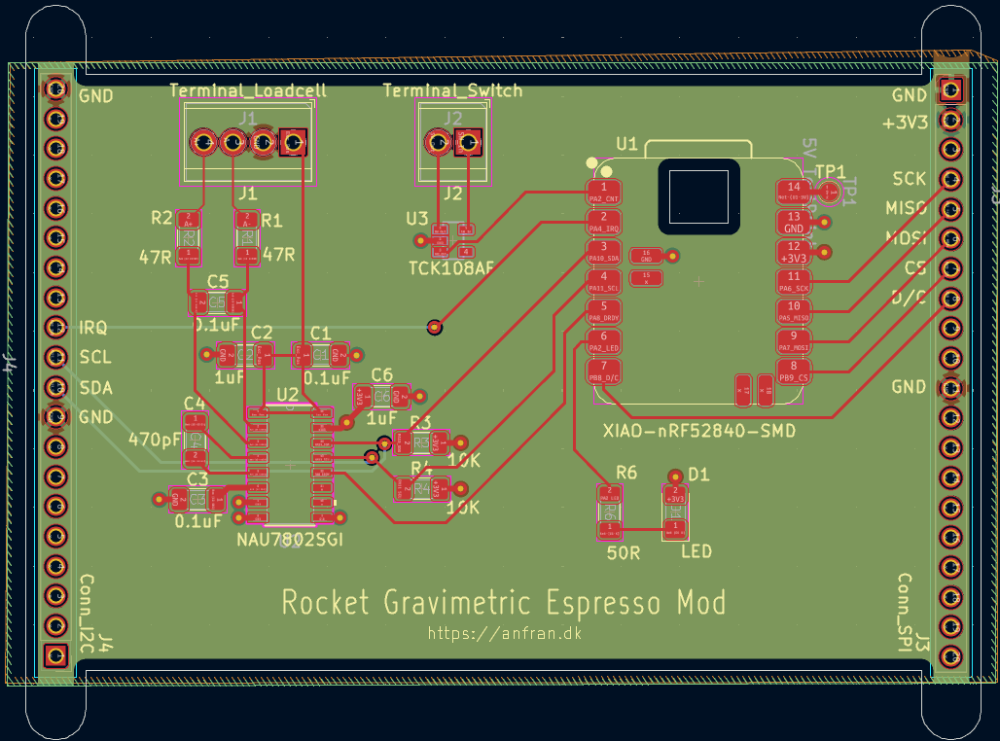
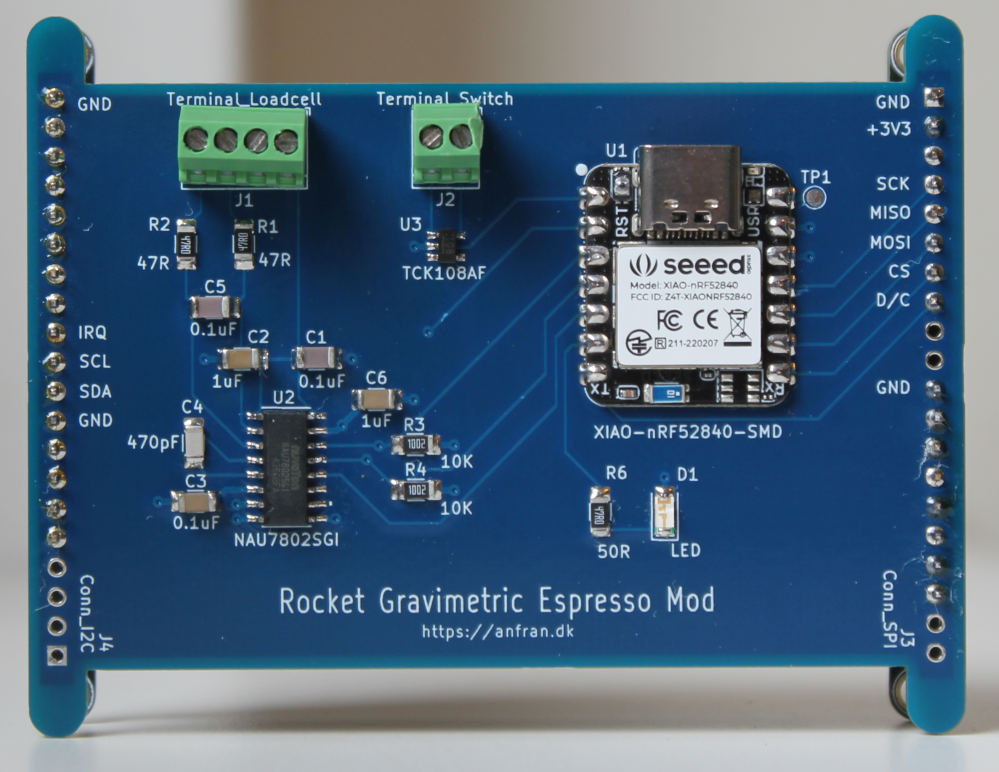

# Hardware

Custom PCB for the Rocket Gravimetric Espresso project, designed in KiCad 8. The board is powered via 5V USB-C on the XIAO module.

## Components

| Ref | Part | Description |
|-----|------|-------------|
| U1 | [Seeed XIAO nRF52840](https://wiki.seeedstudio.com/XIAO_BLE/) | MCU (I2C, SPI) |
| U2 | [NAU7802SGI](https://www.nuvoton.com/resource-files/NAU7802%20Data%20Sheet%20V1.7.pdf) | 24-bit ADC |
| U3 | [TCK108AF](https://toshiba.semicon-storage.com/info/TCK108AF_datasheet_en_20151229.pdf?did=53240&prodName=TCK108AF) | Load switch for pump control |
| J1 | 4-pin terminal block | [TAL221 500g load cell](https://cdn.sparkfun.com/assets/9/9/a/f/3/TAL221.pdf) connection |
| J3, J4 | 20-pin headers | SPI and I2C breakout for the ([Adafruit 2.8" TFT](https://www.adafruit.com/product/2090)) |

## PCB Layout

## Soldered Board

